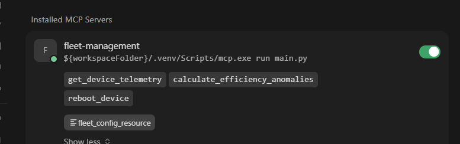
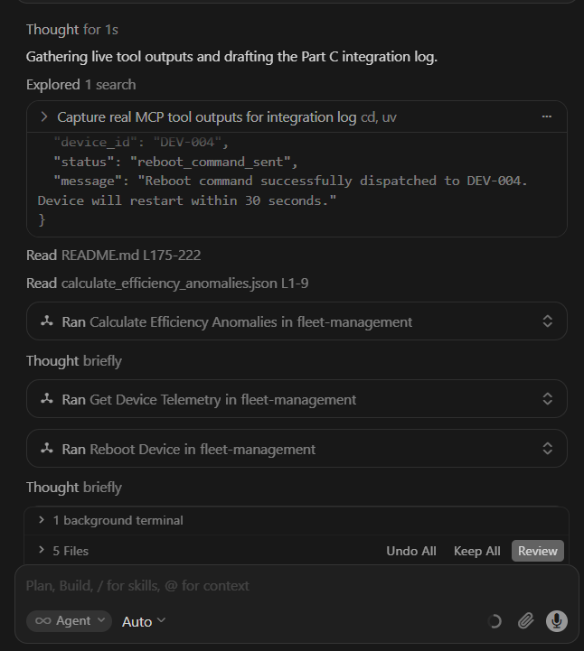

# Part C: LLM Integration Test

**Date:** 2026-06-08  
**Environment:** Cursor IDE  
**MCP server:** `fleet-management` (project config: `.cursor/mcp.json`)

> **Reproducibility:** all tool responses below are **deterministic** — seeded telemetry and static fleet config produce the same values on every run. Only reboot cooldown timing varies (uses `datetime.now()`).

---

## 1. How the model understands which tools exist

When `fleet-management` connects, Cursor exposes the server's capabilities to the model via the MCP protocol. The model receives each **tool name** and **description** (from the `@mcp.tool()` docstrings in `fleet_management_server.py`).

| Tool | Description exposed to the model |
|---|---|
| `get_device_telemetry` | Returns the latest telemetry reading for a given device: voltage, current, temperature, and power. |
| `calculate_efficiency_anomalies` | Compares each device's recent 24-hour power consumption against its historical baseline and returns anomalous devices. |
| `reboot_device` | Sends a reboot command to an anomalous device only. Rejects healthy devices and enforces a per-device cooldown. |

**Resource:** `devices://fleet-config` — full fleet configuration (device list, region, settings).

**Evidence:** Cursor MCP settings showing all registered tools and the resource:



The model does not guess tool names — it selects from this list based on the user prompt and each tool's description.

---

## 2. When the model chooses `calculate_efficiency_anomalies`

The model calls `calculate_efficiency_anomalies` when the user asks a **fleet-wide** question about efficiency, power consumption, or anomalies — not when asking about a single device or requesting a reboot.

| User intent | Tool the model chooses | Why |
|---|---|---|
| "Check fleet for anomalies" | `calculate_efficiency_anomalies` | No `device_id` needed; scans all devices |
| "Which devices consume too much power?" | `calculate_efficiency_anomalies` | Matches tool description (24h baseline comparison) |
| "Get telemetry for DEV-002" | `get_device_telemetry` | Specific device, raw readings |
| "Reboot DEV-001" | `reboot_device` | Action on one device |
| "List all devices" | `devices://fleet-config` resource | Configuration, not telemetry |

**Decision flow:**

```
User asks about fleet health / anomalies / efficiency?
  → YES → calculate_efficiency_anomalies()
  → NO  → specific device mentioned?
            → YES → get_device_telemetry(device_id) or reboot_device(device_id)
            → NO  → read devices://fleet-config
```

**Evidence:** In Test 1 below, the prompt *"Check the fleet for efficiency anomalies..."* led the model to call `calculate_efficiency_anomalies` first — before any per-device or reboot action.



The screenshot shows the execution trace: `Ran Calculate efficiency anomalies in fleet-management` — confirming the model selected the correct tool for a fleet-wide scan.

---

## 3. How the model presents insights to the user

The model does **not** paste raw JSON to the user. It uses the structured tool response and translates it into plain language:

| Server field | How the model uses it |
|---|---|
| `summary` | Opening line — e.g. "2 of 5 devices anomalous, worst: DEV-004 (+101%)" |
| `anomalies[]` | Bullet list with device name, location, percent increase |
| `anomaly_count` | Confirms scope (2 of 5 devices) |
| Severity order | DEV-004 first (+101%), then DEV-002 (+81.8%) |

**Example — user prompt:**

> Check the fleet for efficiency anomalies and tell me which devices need attention.

**Tool called:** `calculate_efficiency_anomalies()`

**Tool response (raw):**

```json
{
  "status": "anomalies_detected",
  "summary": "2 of 5 devices anomalous, worst: DEV-004 (+101.0%)",
  "anomaly_count": 2,
  "truncated": false,
  "anomalies": [
    {
      "device_id": "DEV-004",
      "name": "Heat Exchanger D",
      "location": "Plant 2 - Zone B",
      "historical_average_power_watts": 2255.82,
      "recent_average_power_watts": 4534.9,
      "percent_increase": 101.0
    },
    {
      "device_id": "DEV-002",
      "name": "Pump Station B",
      "location": "Plant 1 - Zone B",
      "historical_average_power_watts": 2425.55,
      "recent_average_power_watts": 4410.83,
      "percent_increase": 81.8
    }
  ]
}
```

**Model response to user (translated insights):**

Two of five devices are consuming significantly more power than their 24-hour historical baseline:

1. **DEV-004 (Heat Exchanger D)** — worst offender at **+101%** power increase (Plant 2 - Zone B). Priority investigation.
2. **DEV-002 (Pump Station B)** — **+81.8%** increase (Plant 1 - Zone B). Secondary concern.

The other three devices are within normal parameters. Recommended next step: pull live telemetry for DEV-004 before deciding on remediation.

The model prioritized by severity, used human-readable names (not just IDs), and suggested a next action — without exposing raw telemetry rows.

---

## Additional test scenarios

### Test 2 — Device telemetry drill-down

**User prompt:** > Get the latest telemetry for DEV-002 and explain if it looks abnormal.

**Tool called:** `get_device_telemetry(device_id="DEV-002")` — not `calculate_efficiency_anomalies`, because the user asked about one device.

**Model insight:** Confirmed elevated power (4,412 W vs ~2,425 W baseline) and temperature (95.1°C), linking readings back to the earlier anomaly flag.

### Test 3 — Reboot guardrail

**User prompt:** > Reboot DEV-001 to fix the issue.

**Tool called:** `reboot_device(device_id="DEV-001")` → `reboot_rejected` (healthy device).

**Model insight:** Explained that reboot is only allowed for anomalous devices (DEV-002, DEV-004), demonstrating the guardrail in user-facing language.

---

## Summary

| Part C requirement | Documented | Evidence |
|---|---|---|
| Model understands which tools exist | Yes | MCP settings screenshot + tool table |
| Model chooses `calculate_efficiency_anomalies` appropriately | Yes | Decision table + Test 1 + execution screenshot |
| Model presents insights clearly to user | Yes | Raw JSON vs translated response comparison |

The LLM integrates correctly with `fleet-management`: it discovers tools via MCP, selects `calculate_efficiency_anomalies` for fleet-wide health questions, and presents structured tool output as actionable insights for the user.
